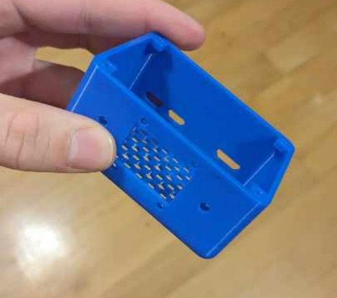
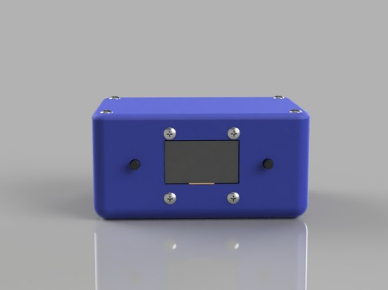
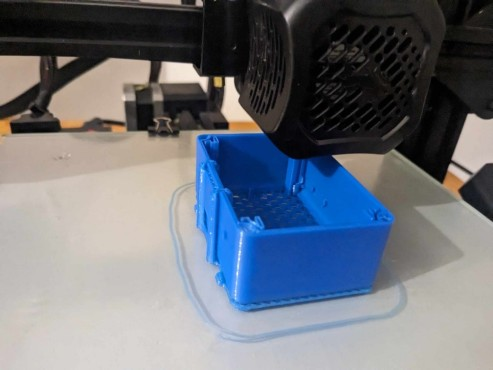

# Raspberry pi zero 2 case with screen

A simple case design created with the intention of replacing an expensive original case (without the possibility of mounting a radiator) with the ability to mount a display based on the SH1106 controller and similar ones.

# Sample photos

## Final effect

## Render

## Printing:

# Files
### STL:
[raspberry.stl](raspberry.stl)
### OBJ:
[raspberry.obj](raspberry.obj)
### F3D:
[raspberry.f3z](raspberry.f3d)
\
